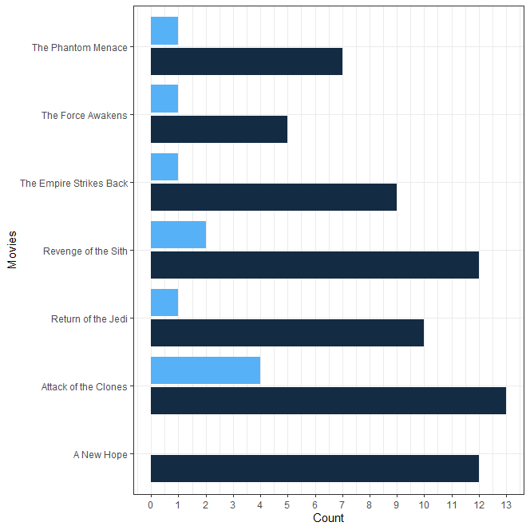

# starwars_skin_analysis

Analysis of skin tone of Star Wars characters across 7 movies.

Lightblue represents dark-skin (dark and tan) actors
Darkblue represents white-skin (white, fair, light, pale) actors.

